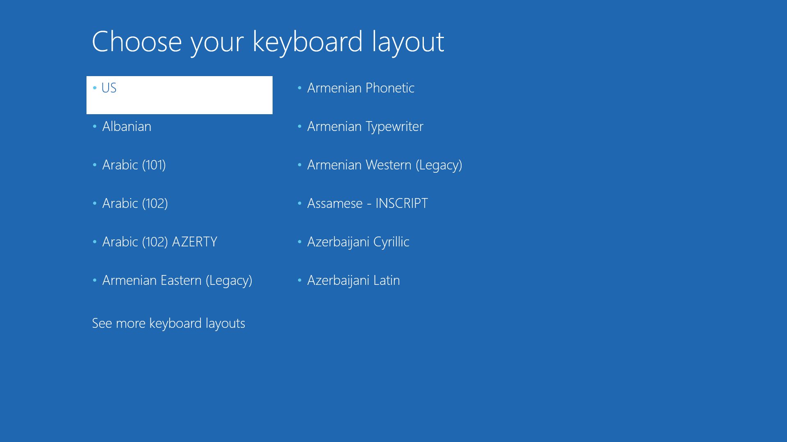
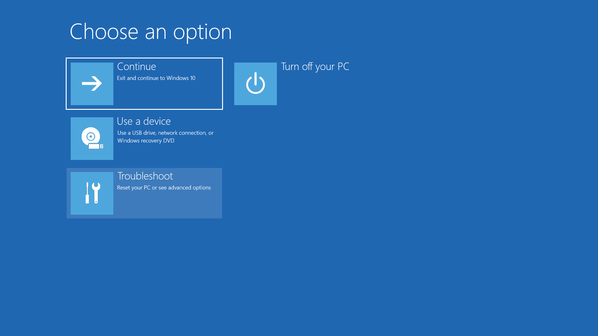
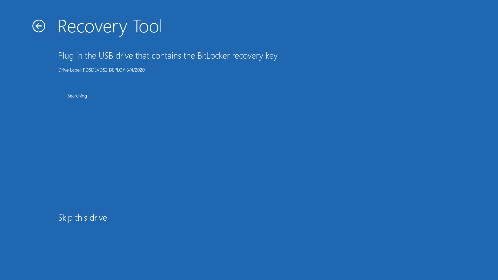
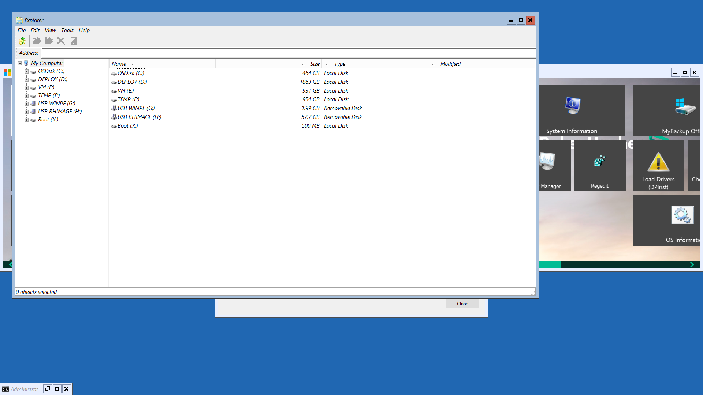

# BitLocker KeyProtectors


These new functions have not been released yet, and will be part of the OSD PowerShell Module 21.2.10 later today


So I'm doing some work in my OSD PowerShell Module and I need to do some work on BitLocker, so I decided to write a new function called Get-BitLockerKeyProtectors. I started this because I was backing up my KeyFiles and I could never get one for MountPount C:. I also noticed that I had multiple KeyFiles for MountPoint D:. So here is the result of my work **(and yes there is a parameter to show the RecoveryPassword, but that is for another post)**

To make things easier for you to tell if you have issues, there are Warnings thrown if you don't have an ExternalKey or RecoveryPassword, or if you have too many

.png>)

## Add-BitLockerKeyProtector

So my first problem is that I don't have an ExternalKey for MountPoint C:. It's easy enough to add the BitLocker ExternalKey by using the **Add-BitLockerKeyProtector** function


AutoUnlockProtector cannot be enabled for the OperatingSystem Volume


So I'll use the following command to create the ExternalKey and back it up to my USB Drive

```
Add-BitLockerKeyProtector -MountPoint C: -RecoveryKeyProtector -RecoveryKeyPath I:\
```

Now the warning for MountPoint C: is gone

.png>)

It even added the BEK file to my USB Drive

.png>)

## Remove-BitLockerKeyProtector

Now time to address my second problem which is that I have 3 ExternalKeys for MountPoint D:. I'm pretty sure that this came from swapping drives from one BitLocker'ed computer to another, but it's hard to tell. I'll start by getting my KeyProtectors and filtering out just MountPoint D:, and then filter just my ExternalKeys

```
Get-BitLockerKeyProtectors | ? MountPoint -eq D:
Get-BitLockerKeyProtectors | ? MountPoint -eq D: | ? KeyProtectorType -eq ExternalKey

```

.png>)

From here I notice that two of the three ExternalKeys do not have AutoUnlockProtector's enabled, so those are the two that I want to remove, so I'll filter those down further. Finally I'll pipe that to **`Remove-BitLockerKeyProtector`** ... and I'm all good.

.png>)

## Get-BitLockerKeyProtectors

Now this looks right to me, but my goal here is to export my ExternalKeys and RecoveryPasswords to a USB, so let's move on

.png>)

## Save-BitLockerRecoveryPassword

Another new function in the OSD Module which was super-easy to make allows me to save my Recovery Passwords for all my MountPoints to TXT files. In this example I saved them to a USB Drive, and even have the file contents look like it was exported from Control Panel. Additionally, the file name includes the ComputerName and the MountPoint

.png>)

.png>)

## Save-BitLockerExternalKey

Finally this new function which will export my ExternalKeys as BEK files, which will allow me some AutoUnlock functionality

.png>)

.png>)

## Finally


The following screenshots were taken in WinPE with Get-ScreenPNG, which is in the OSD PowerShell Module


So why go through all this trouble? So when I boot into WinPE or Recovery Environment I can do this






#### For each of my 4 BitLocker Drives, I get prompted to 'Load your recovery key from a USB device'


#### Each time, the ExternalKey is found automatically and I repeat the process



#### Now everything should be unlocked, I can proceed to Microsoft DaRT


#### With full access to my BitLocker Drives



## One More Thing

I just added Save-BitLockerKeyPackage as well since Microsoft says it can be used with Repair Tools for Drive Corruption



.png>)
