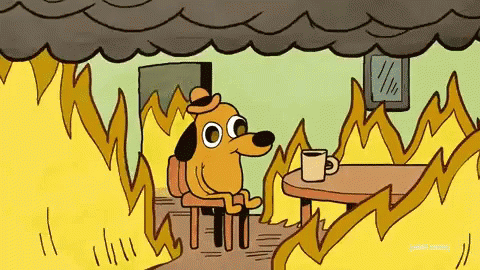

# Action a PowerShell File

So you want to create a Scheduled Task and Action with a PowerShell Script (.ps1 file)?

In reality, avoid this if you can.  While the file you Action may not do anything harmful, a file can be easily replaced with content that does invoke bad things.  If you still want to go this route, it should be easy enough to sort out ... but as an alternative, read the next page on how to run a PowerShell Encoded Script
