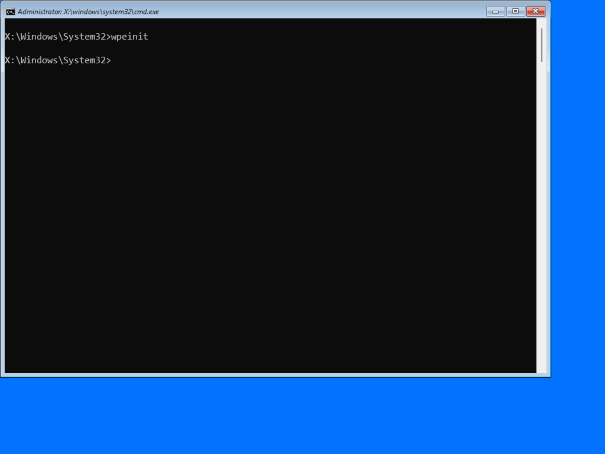

# WinPE - Preinstallation Environment (winpe.wim) ADK

<figure><figcaption></figcaption></figure>

## Boot Process



#### winlogon.exe

```
HKEY_LOCAL_MACHINE\SYSTEM\Setup\CmdLine
REG_SZ
winpeshl.exe
```



#### winpeshl.exe

```
YYYY-MM-DD HH:mm:ss.SSS, Info    Windows PE Shell beginning execution
YYYY-MM-DD HH:mm:ss.SSS, Info    Beginning PNP initialization.
YYYY-MM-DD HH:mm:ss.SSS, Info    Succeeded launching application X:\windows\system32\WallpaperHost.exe [command line: X:\windows\system32\WallpaperHost.exe]
YYYY-MM-DD HH:mm:ss.SSS, Info    PNP initialization succeeded; terminating thread.
YYYY-MM-DD HH:mm:ss.SSS, Warning Failed to launch application (null) [command line: X:\$Windows.~BT\sources\setup.exe] [0x80070002]
YYYY-MM-DD HH:mm:ss.SSS, Warning Failed to launch application (null) [command line: x:\setup.exe] [0x80070002]
YYYY-MM-DD HH:mm:ss.SSS, Info    Succeeded launching application (null) [command line: X:\windows\system32\cmd.exe /k startnet.cmd]
```



#### startnet.cmd

```bat
wpeinit

```



## Wallpapers



#### winpe.jpg

<figure><figcaption></figcaption></figure>



## Content


WinSxS removed



